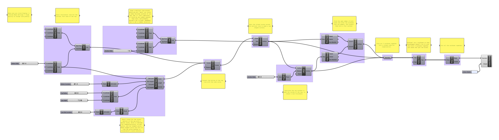

# Week 2 · Parametric Rigs

This week, let's discuss how we as designers can fully *parameterize* a specific opportunity into a set of dimensionable, flexible, understandable, and ultimately manufacturable or implementable aspects. This approach has much in common with traditional design and engineering methods, though differs meaningfully in its intentionality and expression.

-----

### References for the Week

- [Tylko Bookshelves](https://tylko.com)
- [Article on Tylko with Founder Interview](https://www.curbed.com/2015/6/24/9946872/tylko-furniture-app-augmented-reality)
- [Floyd](https://floydhome.com/products)
- [De-Sk](https://de-sk.co/buy)
- [Radiolaria by Nervous System](https://n-e-r-v-o-u-s.com/projects/albums/radiolaria-2/)

-----

### Parametric Rigs

A critical phase in any generative design approach is the creation of a parametric rig. A parametric rig is the determination of the *designable* and *intentional* aspects of a product, service, or experience. It is important that these aspects all be given names, and have a known degree of flexibility.

When parameters are fully determined, we should then have a skeleton of the product to be. Playing with the parameters should allow a designer to see the full expression of their design — the constellation of all products that might result from their design intent.

It is easiest to consider physical products when implementing parametric rigs. For example, the simple parameters of a ceramic cup might be total height, radius/diameter at top, radius/diameter at bottom, foot height, and wall thickness. It is often the case that the simple parameters of a product align with what would be defined in a standard engineering drawing.

More complex parameters might allow for material selection, overall (non-conic) shape, handle shape and size, lip geometry, styling and surface finish, ethical decisions about the  environmental impact of its manufacture and social condition of its fabricators, intended product lifespan...

How might we begin to parameterize something like a subscription service in this way?

-----

### Types of Parameters

- Flexible : The parameter is entirely free (a shoe could be *any* length)
- Categorical : The parameter is allowed to be any member of a set of fixed values (a table could be a *circle*, a *hexagon*, or a *square*)
- Fixed : The parameter has a set value that cannot change (a fork must have *four* tines)
- Dependent : The parameter is algorithmically calculated or determined based on other parameters (the width of a car is *exactly half* its length)

Further, any of the above parameter types may be *optional*, and need not always be numbers!

-----

### Grasshopper Definition

Let's take a look at how a table like [De-Sk](https://de-sk.co/buy) could be parameterized and recreated in Grasshopper.

[Download](desk-generator.gh)

What other parameters could we imagine implementing? 

-----

### Homework

Grasshopper is complicated, and the only way to get good at it is to practice. We will be doing lots of exercises, learning how the tool can enable new design approaches like [evolutionary modeling](http://www.kramweisshaar.com/projects/breeding-tables), [growing design solutions](http://arandalasch.com), and [data-driven form](https://www.adriensegal.com). Please complete all of these homework bits and pieces before next week, and bring all your work to class.

- Unfortunately, there are not a whole lot of good beginner-level tutorials for Grasshopper. Many web searches will yield answers from the POV of mathematicians and grasshopper experts. One good resource is [Formularch](http://formularch.blogspot.com) — please check out some of their examples to see some exciting stuff that is possible with Grasshopper!

- Create, on paper, *parametric rigs* for these objects and challenges. Definitely begin this work by image searching to see the existing range of design solutions, and attempt to delineate many specific designable parameters.
	
	- An *umbrella* that is able to be used in different climates
	- A simple *wallpaper pattern* that accomodates users with various degrees and sorts of vision impairment
	- A *stool/chair* for people of various heights and specific postures and movements associated with design tasks.

- To reinforce the Grasshopper tools we covered this week, *recreate* this parametric rig of a simple cup. Play with the sliders — where and how does the rig break?

- [Read this recent article on generative art](https://www.artnome.com/news/2018/8/8/why-love-generative-art)! Next week, we'll be talking about algorithmic randomness and data-driven form.