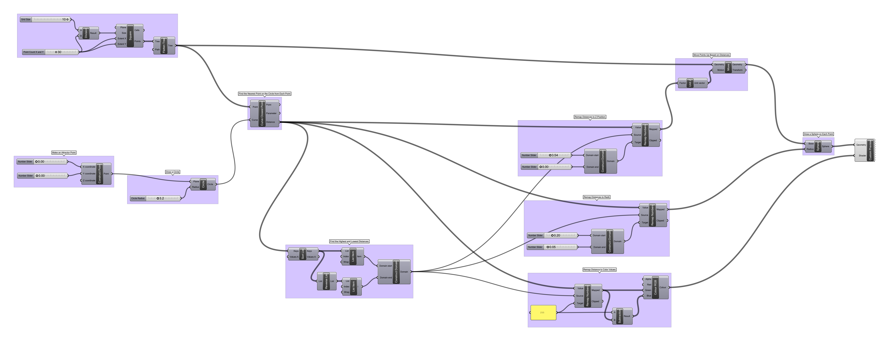

# Week 4 · Algorithmic Randomness

This week, let's discuss how randomness can aid a generative design process, and serve as the foundation for contemporary design opportunities. The focus this week will be on 2D patterns and generative art forms for pedagogical reasons, though the topics covered will serve frequently as both generative tools proper as well as testing and visualization inputs for our parametric rigs.

-----

### References for the Week

Some generative design works featuring (often procedural) randomness.

- [Fast Company article on Randomness in Design and Architecture](https://www.fastcompany.com/3052333/the-value-of-randomness-in-art-and-design)
- [Glithero](http://www.glithero.com/work)
- [Maarten Baas](http://maartenbaas.com)
- [Spotlight on Generative Artist Manolo Gamboa Naon](https://www.artnome.com/news/2018/8/8/generative-art-finds-its-prodigy)
- [Mischer Traxler](http://mischertraxler.com/projects/)
- [Artsy Generative Art Category](https://www.artsy.net/gene/generative-art)
- [Kadenze Free Generative Art Certificate in 9 Hours(!?)](https://www.kadenze.com/courses/introduction-to-generative-arts-and-computational-creativity/info)
- [Simon Heijdens](http://www.simonheijdens.com/indexbig.php)
- [Snarkitechture](http://www.snarkitecture.com/drift/)
- [Interactive Generative Music Tool](https://teropa.info/loop/#/inc)
- [Kenny Verbeeck on Randomness as Generative Design Tool](Verbeeck.pdf)

-----

### Randomness

Computational randomness is a philosophically and technically complicated topic, with much disagreement and confusion amongst experts as well as different academic disciplines.

To understand randomness for our design purposes, we need to acknowledge that randomness is *inhuman*. We have no ability to produce real randomness, and we can not even prove whether or not *any series of numbers* is random. Likewise, no computational tool we use can be truly random.

Yet, though we can't generate randomness, the world exhibits randomness *everywhere*. And, as designers, we often need to confront and probe that randomness as a modelable and definable input into our design research process. Users behave randomly in many situations, they are sized and shaped in random combinations, they live in random locales and have unpredictable reactions to stimuli... We often, fundamental to our design discipline, are tasked with probing this randomness and tamping its complexity down into a set of digestable patterns or categories for our clients, our partners, and ourselves. This is our job! 

Because generative design is fundamentally driven by the productive friction between a *controlling* algorithm and an *uncontrollable* set of inputs, fully engaging randomness is a powerful tool. Random data can be used to model the variability of our user group and their behaviors. More importantly, random values can help test if the boundaries of an algorithm are fully considered, and will often reveal startling combinations that we might not otherwise consider. 

In many ways, a randomness-driven approach may seem fundamentally opposed to contemporarily-elevated *data-driven* approaches, which will be the focus for much of the rest of the course. But, the same tools and logics that allow us to play with randomness also allow us to plug real data directly in, once it is collected and available. So, randomness can be fundamentally generative, serve as a placeholder, and help us evaluate our final outcomes. Powerful!

-----

### Types of *Aleatory* Randomness

Set-theory randomness, or the *predictability of the next element in a series*, can be [categorized](https://en.wikipedia.org/wiki/Random_number_generation) as follows. Note that the examples are simply didactic and human-generated, and will not survive any real mathematical scrutiny.

- Non-Random: Every element in the series is entirely predictable
	- 1, 2, 3, 4, 5...
	- 1, 1, 2, 3, 5...
	- 2, 4, 6, 8, 10...

- [Pseudo-Randomness (Seeded Randomness)](https://en.wikipedia.org/wiki/Pseudorandom_number_generator): Given a series of inputs, an *effectively* unrelated outcome will result in the series for each input. The same input will always yield the same output, though a study of different inputs will never reveal a *consistent* relationship between different inputs and their associated outputs.
	- Seeds: 4, 1, 6, 4, 3... -> Outputs: 9.213, 3.532, 4.089, 9.213, 5.652 

- Initial Condition Randomness: A starting state is defined, and then effective randomness ensues — though outcomes are fundamentally constrained by that initial condition. Imagine a bunch of spheres rolling down a rocky mountain — the final resting point of each sphere is random, though it will be related somewhat to where the sphere started. 
	- Start: 3 -> Outputs: 2, 9, 5
	- Start: 27 -> Outputs: 72, 17, 63
	- Start: .06 -> Outputs: .09, .04, .03

- True Randomness (Environmental Randomness) : There is no consistent relationship between any number in the series and any other number in the series. Neither humans nor machines can generate true randomness — though we certainly [have tried](http://www.lavarand.org)!
	- Life ([Maybe?](https://en.wikipedia.org/wiki/Determinism))

Consult this [plain language explainer](http://www.statisticsblog.com/2012/02/a-classification-scheme-for-types-of-randomness/) for more info and a slightly different classification system. An understanding of these taxonomies is especially important for generative design, as an appropriate choice of randomness will often determine how useful any random testing is to a generative design exercise.

-----

### Grasshopper Definition

Let's get better at handling lists of data and randomness in Grasshopper by creating some generative art!

#### Distance-Based Circles

Create a grid of circles and use the distance to a single movable point to determine the circles' radii.

[Circles](circles.gh)

#### Closest Point Walker

Draw lines to a number of nearest grid points from a single movable point.

[Walker](walker.gh)

#### Attractor/Repulsor

Distort a grid of points with a single movable point.

[Attractor/Repulsor](attractor+repulsor.gh)

#### After Vera Molnar / Jared Tarbell

Experiment in randomness to produce geometric patterns similar to [Molnár](http://www.veramolnar.com) and [Tarbell](http://www.complexification.net/gallery/).

[randompattern](randompattern.gh)

	
-----

### Homework

We will be discussing data-forms next week!

- Read: Download this PDF of [*Thinking Objects* by Tim Parsons](ThinkingObjects.pdf), a contemporary design theorist. [Buy the book](https://www.amazon.com/Thinking-Objects-Contemporary-Approaches-Product/dp/2940373744) if you like it, it's totally worth having on your shelf! These selections discuss different motivations we might bring into a design projects other than traditional user-centrism and financial development. We'll delve into several other sections of this text through the semester, so hold onto the PDF. Please read **sections 1.1-1.3, 2.1-2.5, 2.8, and lastly and most importantly 2.12**. It shouldn't take more than an hour, the chapters and short and there are lots of pictures. Please look up any referenced works that you're not familiar with. Prepare to converse as a class on this text. How does the language, logic, and content of this book compare with other things you've read in other classes?

- Investigate: Browse this [painstakingly curated reference}(http://dataphys.org/list/) of *physicalized data*, or 3-dimensional data visualizations. The list is chronological, so head towards the bottom for more contemporary stuff. Find one for each of the following criteria, and prepare to discuss your choices.

	- A physicalization that is compelling to you with respect to the *data* that is physicalized.
	- A physicalization that is compelling to you with respect to the *form* and *design* of the object itself.
	- A physicalization that is compelling to you with respect to the *emotional or intellectual impact* of the object and its story if you had it in your home or workplace.

Some questions about these examples to consider... Are these objects *designed objects*? If not, what are they? What makes some of these objects more *legible* than others? How should we attempt to evaluate if some of these objects are more *successful* than others? Why might a user actually want to engage this type of object? 

- Model: Recreate this water ripple simulator to reinforce the work we did this week. Play with all the sliders when you are done! Is there anywhere we could inject a random node into for more interesting behavior? 

