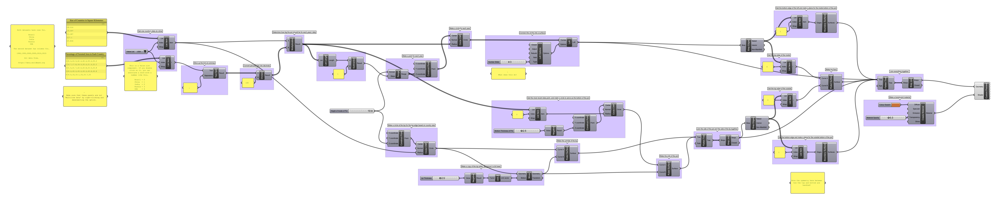

# Week 5 · Data Forms

We'll examine this week how contemporary designers are using data — both at an individual and global level — to create uniquely meaningful 3d forms with functional, aesthetic, and public awareness goals.

This particular emerging topic — the creation of a different type of *smart-object* — sits at the nexus of data science and visualization, generative design practice, and communication design.

-----

### References for the Week

Some examples of designed data forms.

- [Dataphys List](http://dataphys.org/list/)
- [Adrian Segal](https://www.adriensegal.com)
- [Mischer Traxler](http://mischertraxler.com/projects/)
- [Paul Heinicker](http://paulheinicker.com)
- [Iohanna Pani](http://iohanna.com/filter/DESIGN)
- [DNA Glass](https://adage.com/creativity/work/suntory-dna-glass/50254)

Some data visualization references.

- http://www.dear-data.com 
- www.informationisbeautiful.net
- www.datapointed.com
- www.visualnews.com
- http://nytlabs.com
- http://flowingdata.com
- http://fivethirtyeight.com
- http://infosthetics.com
- http://www.creativeapplications.net
- http://www.datavisualization.ch

-----

### Tactile Data


Data forms, a new term for an even newer aesthetic archetype, is a very young discipline. As data visualization has become more common in 2D and interactive applications — 3-dimensional artists, architects, and designers have begun to experiment with physicalized 3D data — and have questioned how we can effectively communicate more complex information through 3D form. 

Embedding data in physical 3D rather than 2D form allows for many obvious benefits. Materiality, surface finish, color, scale, texture, volume, enclosedness, placement in the world, weight... these all become meaningful choices in 3D form, and provide additional vectors for data-driven intentionality.  More intrigueing, perhaps, these same designers have experimented with creating data forms that replace traditional objects — provoking users to engage them as everyday in everyday confrontations — constant and unavoidable reminders of the embedded data with the goal of both awareness and behavior change. 

Would you eat differently if your tableware reminded you of the world's obesity epidemic? Would you use your computer differently if its palmrest was shaped with data of your region's energy usage? Would you spend your days differently if your couch was cushioned with the data of the time you and your friend group spend on Facebook and Netflix?

-----

### Open Data Sources

##### Data Search Engines and General Directories
- https://www.data.gov
- https://www.census.gov/developers/
- http://www.zanran.com/q/
- https://www.reddit.com/r/datasets/   (and check out the linked subreddits too!)
- https://github.com/toddmotto/public-apis
- https://www.google.com/publicdata/directory
- https://en.wikipedia.org/wiki/List_of_datasets_for_machine_learning_research
- https://tinyletter.com/data-is-plural

##### Municipal
- https://data.cityofchicago.org
- https://nycopendata.socrata.com/

##### Atmospheric and Geologic
- http://www.ndbc.noaa.gov
- https://www.ncdc.noaa.gov/cdo-web/
- http://weather.rap.ucar.edu
- https://earthquake.usgs.gov/data/
- http://www.ssec.wisc.edu/data/
- https://cfpub.epa.gov/surf/locate/index.cfm
- http://volcano.ssec.wisc.edu

##### Space!
- https://data.nasa.gov
- http://chandra.harvard.edu
- http://sid.stanford.edu/database-browser/

##### Transportation
- https://github.com/graphhopper/open-traffic-collection
- http://opentraffic.io
- https://jblevins.org/notes/airline-data
- https://www.fra.dot.gov/Page/P0365

##### Social
- https://meta.wikimedia.org/wiki/Datasets
- https://developers.facebook.com/docs/graph-api
- https://www.google.com/trends/explore
- https://dev.twitter.com/streaming/overview
- https://www.cia.gov/library/publications/the-world-factbook/

##### Financial
- https://www.quandl.com
- http://data.worldbank.org
- https://www.google.com/finance

##### Animals and Plants
- https://www.gbif.org
- https://beeinformed.org
- https://www.movebank.org
- http://archive.ics.uci.edu/ml/datasets/zoo
- http://whale.wheelock.edu/whalenet-stuff/StopBm2016/
- https://cvml.ist.ac.at/AwA/
- https://ecologicaldata.org/find-data

-----

### Grasshopper Definition

Let's manipulate outside data in Grasshopper 


#### Data Plotting

Different ways to plot 3d points based on information (here random numbers) and convert those points into a variety of 3d forms.


[dataplot](dataplot.gh)


-----

#### Data Samples

Draw real data in Grasshopper.


[datasamples](datasamples.gh)

-----

### Homework

We will be discussing anthropometry next week!

- Read: Download this PDF copy of the original [Measure of Man](MeasureOfMan.pdf) by Henry Dreyfuss (released in 1959) and the revised version [Measure of Man and Woman](MeasureOfManAndWoman.pdf) edited by Alvin Tilley (released in 1993) and Henry Dreyfuss Associates (the company Henry Dreyfuss founded). Please also read about [Henry Dreyfuss](https://en.wikipedia.org/wiki/Henry_Dreyfuss), the original author and one of the first *data-driven designers*.

	Browse through the whole books (they're mostly pictures) to get a sense of the contents, and please read pages 7-11, 33, 35, and 36 of *Measure of Man and Woman*. Also prepare to discuss the *motivation* of these texts, and how we should confront them as *inclusive* designers. Are texts like this useful to our design practice? How might different disciplines — like the many social sciences, humanities, and different engineering areas — evaluate our design discipline's reliance on books like this?  

- Investigate: Take a look through the many data sources linked above and bookmark some personally interesting, unexpected, and meaningful datasets. 

- Model: Please recreate this discursive data form, drawing attention to several countries' respective deforestation activities and policies.

	

	Data forms that carry a family similarity to traditional object archetypes are often more effective than the 'data-blobs' that are expected of traditional data visualization. By embedding data in everyday objects, we can easily make data more approachable, legible, and confrontational to audiences. Here, let's create a set of gardening pots, which demonstrate in 3-dimensions the history of the forested area of 5 large countries: Brazil, China, India, Russia, and the United States. The inside volume of the pot will be shaped by the history of the various countries' forested percentage, and the outside volume will make clear the proportional size of the country and its most recent (2015) forest amount. The smaller the remaining forest, the less room will be available for planting, and the easier the pot will be to topple and shatter — embodying the fragility of the remaining ecosystems. All data is from the [World Bank](https://data.worldbank.org/indicator/AG.LND.FRST.ZS?end=2015&locations=CN-RU-US-BR-IN&start=1990).

	

	#### Country Areas in Square Kilometers Data (Brazil,China,India,Russia,USA)
	```
	8.516
	9.597
	3.287
	17.1
	9.834
	```

	#### Country Areas in Square Kilometers Data (1990,1995,2000,2005,2010,2015)
	```
	65.4,63.9,62.4,60.6,59.6,59.0
	16.7,17.8,18.9,20.6,21.4,22.2
	21.5,21.7,22.0,22.8,23.5,23.8
	49.4,49.4,49.4,49.4,49.8,49.8
	33.0,33.1,33.1,33.0,33.7,33.0
	```

	

	Also browse through these other complementary datasets. Could you find a way to embed some of these other datapoints in your data form?

	- [Global Deforestation Rates by Country](https://rainforests.mongabay.com/deforestation_country.html)
	- [Environmental Performance Indicators](https://epi.envirocenter.yale.edu/epi-downloads)
	- [Global Forest Watch](https://www.globalforestwatch.org)
	- [Population Change](https://data.worldbank.org/indicator/SP.POP.TOTL?end=2005&name_desc=false&start=1990)	
	- [Country Area](https://simple.wikipedia.org/wiki/List_of_countries_by_area)
