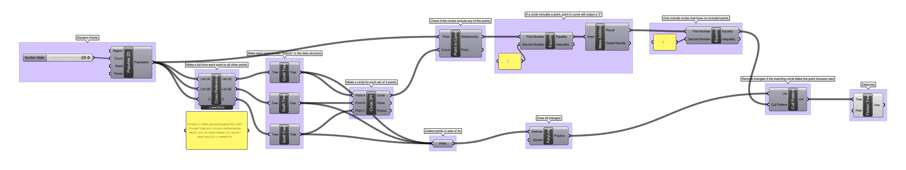

# Week 6 · Anthropometric Patterns

We'll examine this week how contemporary designers are implementing algorithmic processes to address complex design problems.

In particular, we'll look at the related [Delaunay Triangulation](https://en.wikipedia.org/wiki/Delaunay_triangulation) and [Voronoi Tesselation](https://en.wikipedia.org/wiki/Voronoi_diagram) — simple mathematical models for complex natural phenomena. We'll also use [Catmull-Clark Subdivision](https://en.wikipedia.org/wiki/Catmull–Clark_subdivision_surface) algorithm to smooth data-drive, anatomical forms.

-----

### References for the Week

Some examples of pattern algorithm design work.

- [Jerusalem Table](https://www.core77.com/projects/39363/Jerusalem-Tables)
- [Voronoi at Thingiverse](https://www.thingiverse.com/search?q=voronoi)
- [Nervous System](https://n-e-r-v-o-u-s.com/projects/)
- [Marc Newson Voronoi Shelf](http://marc-newson.com/voronoi-shelf/)
- [Go Wheel Chair](http://layerdesign.com/projects/go/)
- [Bespoke 3D Orthopedics Brace](https://www.youtube.com/watch?v=OGRkNexY3N8)
- [Interactive Subdivision](https://www.khanacademy.org/partner-content/pixar/modeling-character/modeling-subdivision/p/interactive-subdivision-in-3d)
- [Pixar in a Box](https://www.khanacademy.org/partner-content/pixar)

- [Unyq](http://unyq.com/en-us/us/)
- [Osteoid Ultrasonic Cast](https://competition.adesignaward.com/design.php?ID=34151)
- [Cortex Cast](http://www.evilldesign.com/cortex)
- [Thermal Comfort Casts](https://3dprint.com/192877/3d-printed-cast-thermal-comfort/)
- [Hand and Wrist Fracture Cast](http://www.machiningnews.com/2017/06/real-world-test-of-3d-printed-cast-for-hand-fracture/)

- [How to Hand Draw Delaunay and Voronoi](http://765.blogspot.com/2009/09/how-to-draw-voronoi-diagram.html)
- [Simple Interactive Voronoi Editor](http://www.sygreer.com/projects/voronoi/)
- [Interactive Javascript Translation](http://paperjs.org/examples/voronoi/)
- [World Capitals Voronoi](https://www.jasondavies.com/maps/voronoi/capitals/)
- [In D3 Data Viz Library](https://github.com/d3/d3-delaunay)
- [Anna Nowak on Application of Voronoi diagrams in contemporary architecture and town planning](https://yadda.icm.edu.pl/baztech/element/bwmeta1.element.baztech-5259df1a-e1f7-442f-a68c-10c0c2b35c96/c/chmot62_06.pdf)

- [All the Maths](http://cgl.uni-jena.de/pub/Workshops/WebHome/cgl12new.pdf)
- [Easier to Understand All the Maths](https://meemoo.org/blog/2014-07-14-noflo-geometry)

-----

### Triangulation, Tesselation, Subdivision

#### Delaunay Triangulation

Developed in the 1930s by Russian geometer [Boris Delaunay](https://en.wikipedia.org/wiki/Boris_Delaunay), the [Delaunay triangulation](https://en.wikipedia.org/wiki/Delaunay_triangulation) is essential to nearly all computer graphics. Whenever you hear or talk about a 'mesh', that's a Delaunay Triangulation! Videogames, visual effects for cinema, medical scanning, arcGIS geographic data — everything! It is also in heavy use by structural engineers, and unintentionally undergirds nearly all of the truss geometries that define bridges, attics, and other triangular structures as well as communication network routing. More recently, as autonomous vehicles begin to explore unmapped areas where sensors may fail, Delaunay Triangulation logic is used to [allow intelligent agents to navigate dangerous boundaries](https://en.wikipedia.org/wiki/Constrained_Delaunay_triangulation). 

In 3D space, the triangulation creates a *network topography* of triangular cells, based on known points to support, that would use the minimal amount of connective material to maintain in opposition to a singular force vector.

- Sprinkle random points on a 2D plane
- Draw all possible circles defined by any of the 3 points
- If those circles contain *any* of the sprinkled points, that circle should be discarded
- If a circle passes the test, then draw the [circumscribed triangle](https://en.wikipedia.org/wiki/Circumscribed_circle) as an edge

#### Voronoi Tesselation

The geometric [*dual*](https://en.wikipedia.org/wiki/Dual_polyhedron) of the Delaunay Triangulation, [Voronoi Tesselation](https://en.wikipedia.org/wiki/Voronoi_diagram) invented by another amazing Russian mathematician — [Georgy Voronoi](https://en.wikipedia.org/wiki/Georgy_Voronoy) — similarly tiles a plane with shapes — though not not usually triangles. The unusual cells that come out of the Voronoi Tesselation model fairly accurately a multitude of natural formal phenomena as well as behaviors. Bone microstructure, sponge anatomy, soil clumping, termite and bee architecture, neuron network arrangement.... the list is almost endless. This is because the Voronoi Tesselation models an *efficient* set of cells. All of the space within a single Voronoi cell is *closer* to the centroid of a Delaunay triangle, and as a result, Voronoi logic approximates how any agent might make a decision about which of a set of possible choices should be chosen based purely on efficiently traversing or covering a plane or volume. It is increasingly being used by public policymakers to [place trainstops, design road networks](http://datagenetics.com/blog/may12017/index.html), and [predict crime](https://www.tandfonline.com/doi/abs/10.1080/00330124.2017.1288578?scroll=top&needAccess=true&journalCode=rtpg20).

- Generate a Delaunay Triangulation
- Find the area centroid of each triangle
- Find the midpoint of each edge, and draw a line perpendicular to the edge
- Intersect all these lines and cut them with one another
- Draw the remnant irregular polygons

#### Catmull Clark Subdivision

Catmull Clark Subdivision is amazing! We'll talk about it in class, it's very difficult to describe in words.

But, play with Pixar in a Box's amazing [interactive tool](https://www.khanacademy.org/partner-content/pixar/modeling-character/modeling-subdivision/p/interactive-subdivision-in-3d)) to get a sense of it.

-----

### Food 4 Rhino

=

[Food4Rhino](www.food4rhino.com) is a central repository for plugins and add-on software for Rhino 3D, as well as for Grasshopper. Plugins for plugins! 

Create a free account on the website and search around. Anything exciting? Unfortunately, not everything will work on Macs and it's impossible to know unless you see an Apple logo under the *Download* button. But, even if *there is not an Apple logo*, it still might work!

To install a Grasshopper plugin, open Grasshopper, and navigate to File -> Special Folders -> Components Folder.

This will open a Finder/Explorer window, into which you can move the downloaded folder. The best practice is usually to drag the entire folder over, not the individual .gha or .ghuser files. You can find Grasshopper plugins all over the internet, not just at Food4Rhino. If you are running Windows, right click on any .exe, .ghuser, and .gha files and click on *Properties*. Make sure to click *Unblock* if it is an option.

For Grasshopper to load newly installed plugins, we just need to restart Grasshopper. Either quit and restart Rhino, or alternatively, in *Rhino* type `Grasshopper unload plugin` and then relaunch Grasshopper.

For this and future exercises, let's install a few specific and essential plugins.

- For better Mesh cleanup: [Mesh Edit Tools *1.9* from Oct 1, 2016](https://www.food4rhino.com/app/meshedit)
- For better Mesh smoothing: [Weaverbird for Mac](http://www.giuliopiacentino.com/get-wb-no-admin/) or [Weaverbird for Windows](http://www.giuliopiacentino.com/get-wb/)

-----

### Grasshopper Definition

#### Image Sampler

Extract brightness data from an image and create a heightmap.

[imagesampler](imagesampler.gh)

-----

#### 'Simple' Delaunay Triangulation

From a field of random points, create Delaunay triangulation

[delaunay](delaunay.gh)

-----

#### Data-Driven Voronoi Cast

Create a voronoi tesselation in 3D space around a data-driven, anatomical form. Allow for variable cell openness based on attractor curve.

[voronoi_cast](voronoi_cast.gh)

-----

#### Data-Driven Delaunay Cast

Create a Delaunay triangulation in 3D space around a data-driven, anatomical form.

[delaunay_cast.png](delaunay_cast.png)

[delaunay_cast](delaunay_cast.gh)

-----

### Homework

We will be discussing evolutionary modeling next week, maybe?!

- Read: Come back after class! 

- Investigate: Come back after class! 

- Model: Come back after class! 