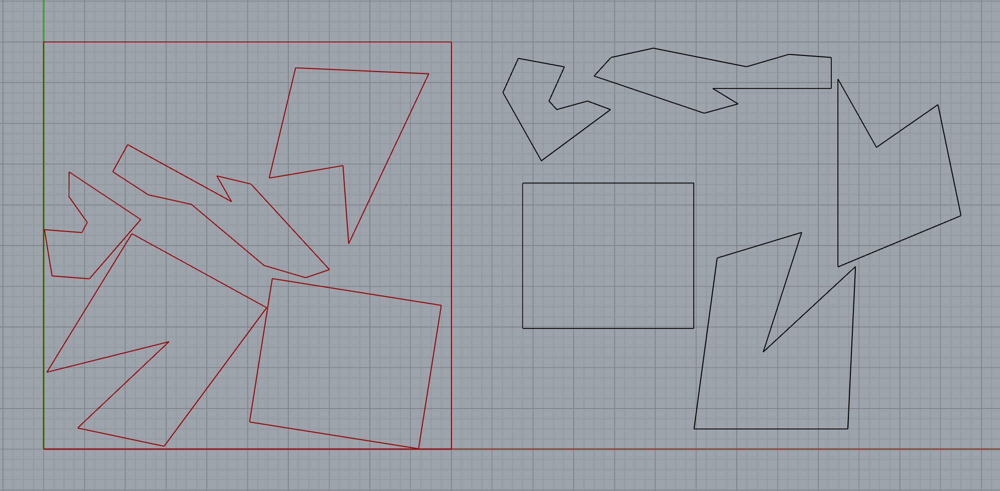
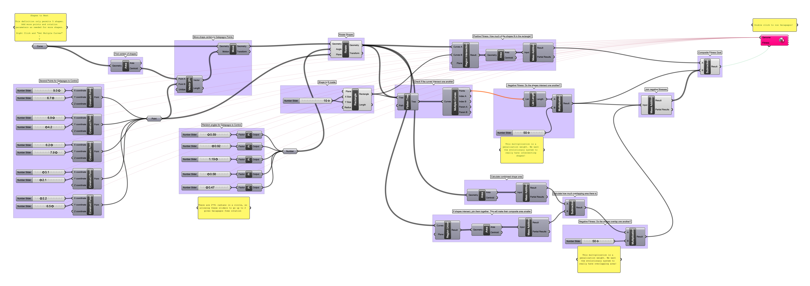
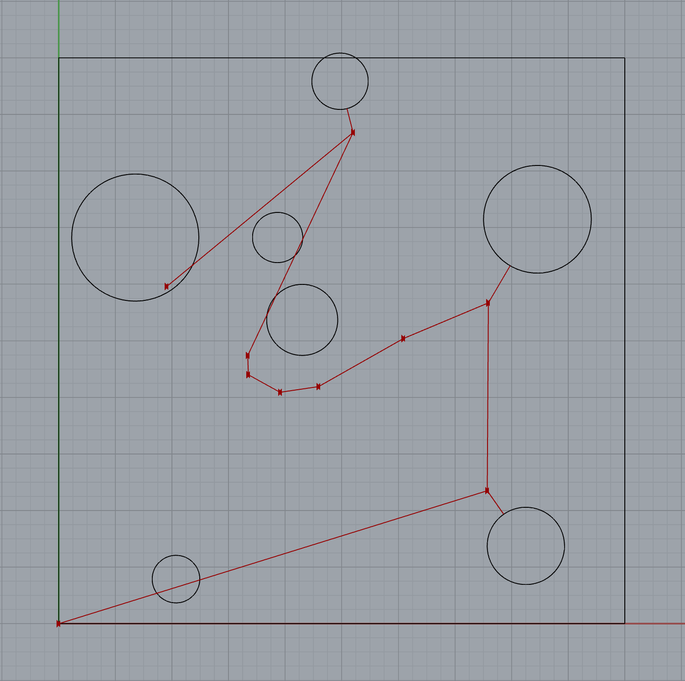
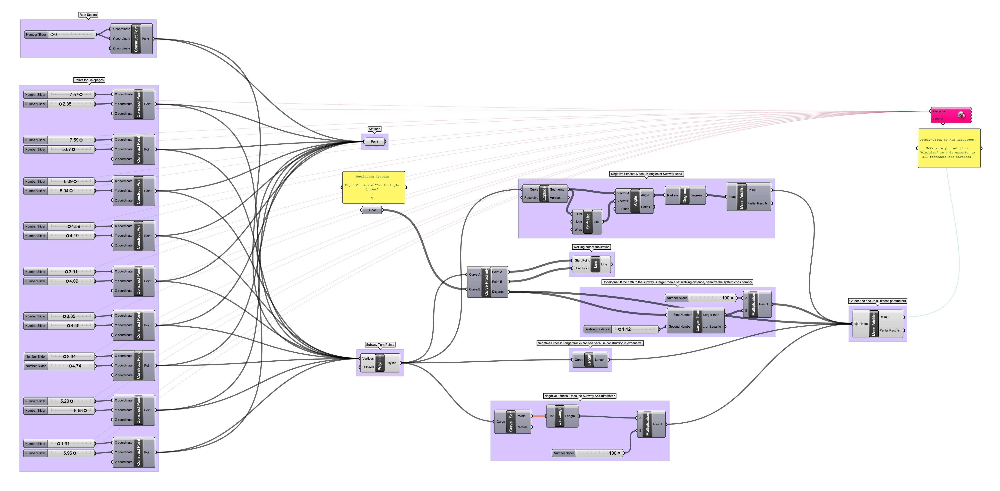

# Week 7 · Evolutionary Form 

Let'e examine how naive [AI modeled on evolutionary genetic descent](https://en.wikipedia.org/wiki/Evolutionary_algorithm) can be integrated into the design process. Evolutionary modeling allows us to biometically integrate the incredible methods that life itself has used over millenia to optimize itself locally within an environmental system. Designers can model a system as a set of rewards and punishments, and push various effectively random lifeforms (our designs!) through the system to see how each fares. Successful lifeforms can pass their genes on, failures and their genetics go extinct over time, mutation keeps things interesting, and the process repeats until a *local* optimum is discovered.

These sorts of tools have recently been adopted, and increasingly are being used, in [public policy development](https://medium.com/@numanovicamar/https-medium-com-numanovicamar-data-science-the-next-frontier-for-data-driven-policy-making-8abe98159748) and [problem solving](https://ideas.repec.org/a/ssi/jouesi/v4y2017i3p364-379.html) as well as [urban planning discourse](https://www.researchgate.net/publication/32884865_Integrated_Urban_Evolutionary_Modeling) — opening up these disciplines to design methodology and systems thinking. In fact, evolutionary modeling could be easily viewed as the computational version of system modeling and prediction (*hint hint course next semester hint hint*).

Also, very importantly, play with [genetic cars](http://rednuht.org/genetic_cars_2/).

-----

#### Evolutionary Algorithms

Any design challenge can be tackled through an evolutionary solver. All that is required is that the design challenge have a clear goal to minimize or maximize (the *fitness*), which is the result of the interplay between a set of variables (the *genome*). 

*Fitness* can be complex and synthesized from several factors, and the most productive fitnesses for evolutionary algorithms to solve for are those that implement two oppositional forces (3d volume and material use in a building, height and structural rigidity in a wind turbine, aerodynamics and fuel load in a rocket). In lifeforms the interplay is similar — bigness is great for overpowering and eating other animals, but if you're bigger, you need more calories to move around and maintain your body heat!

The more parameters that define the *genome*, the more varied and successful the outcomes *can* be, at the expense of computing time. Just like in living organisms, a healthy genome is defined by variability, specificity, and a lack of redundency. 

Life has needed to adapt to both a changing *fitness landscape* (climate change, weather patterns, competitive lifeforms over time) as well as remarkably diverse *fitness conditions* (the sea, the air, land...) and as a result our planet offers remarkably diverse outcomes of specific local maxima solutions — which we call *species*.

Design tools don't quite yet offer that amount of control, but perhaps they soon will!

-----

### References for the Week

Some examples of evolutionarily modeled forms and solutions.

- [Evolving Design by Danil Nagy](https://medium.com/generative-design/evolving-design-b0941a17b759)
- [Engine Block, Chair, Medical Implants](https://www.wired.com/2015/09/bizarre-bony-looking-future-algorithmic-design/)
- [Aesthetics of Simple 3D Form](https://agatakycia.com/2011/12/28/aesthetics-and-creativity-in-evolutionary-design/)
- [Yacht Geometry for Ideal Hydrodynamics and Displacement](http://www.cupinfo.com/en/americas-cup-automated-yacht-design-optimization.php)
- [Antennas for Unusual Environments](https://en.wikipedia.org/wiki/Evolved_antenna)
- [Beach Walking Animals](http://www.strandbeest.com)
- [Stadium Roof Design](https://www.youtube.com/watch?v=RQIXJMmm-0A)
- [Complex Joint Design](https://www.youtube.com/watch?v=wB-Q4erLMYE)
- [Shoes](https://vimeo.com/user2852610)
- [Solar Carve Tower](http://www.archdaily.com/806233/new-images-of-studio-gangs-solar-carve-tower-revealed-as-project-gets-underway)
- [Minimum Solar Exposure to Save Cooling Expense](https://yazdanistudioresearch.wordpress.com/2015/02/09/building-optimization-tools-the-grasshopper-definition-and-breakdown/)
- [Max Solar Exposure](https://gonzalesarch.wordpress.com/tag/grasshopper/)
- [Best Airflow and Heating for Poulty Facility](https://bioarchitecturestudio.com/2011/07/21/organic-farm-yard-pedregal-del-fresno-grasshopper-galapagos/)
- [College Quad Layout based on Desire Lines](http://isia.ir/semiology/)
- [Room Arrangement](http://omarohelmy.blogspot.com/2013/01/experiments-in-space-planning-using.html)
- [Room Arrangment 2](https://www.youtube.com/watch?v=SWyE3V6LKCc)
- [Awning Design](http://archi-lab.net/form-finding-with-grasshoppergalapagos/)
- [Building Layout and Window View Optimization](http://designplaygrounds.com/blog/view-optimization-using-galapagos-for-grasshopper/)
- [Trusses](http://golancourses.net/2013/projects/genetic-algorithm-optimal-trusses/)
- [Suspension Bridge Spans](https://iq.intel.co.uk/neural-networks-genetic-algorithms-computers-getting-creative/)
- [Wind Turbine Blade](https://www.youtube.com/watch?v=YZUNRmwoijw)
- [Learning to Stand](https://www.youtube.com/watch?v=lPQnVEnFTgY)
- [Learning to Walk](https://vimeo.com/85053197)
- [Learning to Walk and Survive Impact!](https://www.youtube.com/watch?v=pgaEE27nsQw)
- [Max Volume : Minimum Area](http://gracefulspoon.com/blog/2011/06/05/bucky-was-right)
- [Breeding Tables](http://www.kramweisshaar.com/projects/breeding-tables)
- [Assorted Examples](http://legacy.iaacblog.com/maa2013-2014-designing-associativity/)
- [Complete Architectural Design from Lot Orientation to Room Details](https://www.youtube.com/watch?v=3sM6qUUJxus)
- [Better Box Car 2D that Doesn't Require Flash](http://rednuht.org/genetic_cars_2/)
- [Motor Train](https://bib.irb.hr/datoteka/255484.383.pdf)
- [Locomotion System](http://www.demo.cs.brandeis.edu/golem/design.html)

-----

### Grasshopper Definition

Let's play god a bit?

#### Nesting

Ask Galapagos to rotate and place weirdly shaped pieces into a boundary without overlapping.

[nesting](nesting.gh)

-----

#### Solar Carve

Minimize cast shadow but maximize volume. Take a look at Studio Gang's in construction [Solar Carve Tower](http://www.archdaily.com/806233/new-images-of-studio-gangs-solar-carve-tower-revealed-as-project-gets-underway) to see these techniques applied.

[solar_carve](solar_carve.gh)

----

#### Subway Routing

Route a subway through a city to adequately serve population centers.

[subway](subway.gh)

-----

### Homework

To be determined! 