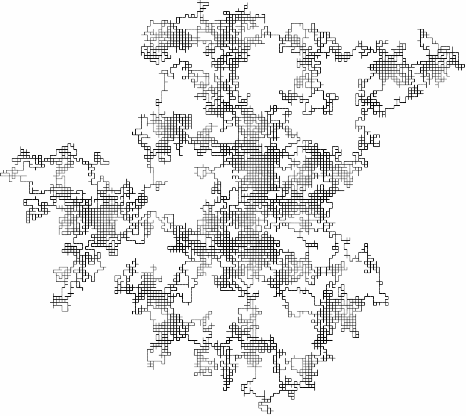
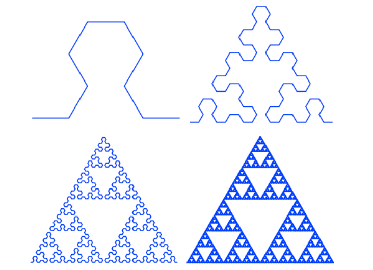
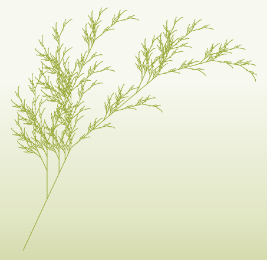

## Growing Forms


An emerging approach in contemporary design (one of the newest of the new!) is a desire to bring the intelligence of living and growing organisms into the design process — and is therefore termed *generative* design (otherwise called *biomorphic* or *agent-based* modeling), wherein a designer considers how an agent with defined abilities and constraints would behave without any intervention. They might move as close as possible to something, avoid other things, move horizontally until they must move vertically, advance and then turn 20 degrees, eat nearby things and grow bigger... straightforward rules like these that emulate the natural behaviors of simple, living organisms. When these straightforward rules are followed by many agents over many generations of individual decisions, the results can be shocking in their complexity and emergent intelligence. Commonly, the paths that these agents traverse are traced, and the resulting lines become raw materials for designed outcomes.

This methodology and logic has its roots in (and mostly has supplanted) the superficial [biomimicry](https://en.wikipedia.org/wiki/Biomimetics) that defined cutting edge design through much of the early aughts with proponents like [Janine Benyus](https://www.ted.com/talks/janine_benyus_shares_nature_s_designs?language=en), [Ross Lovegrove](https://www.google.com/search?client=safari&rls=en&q=rosslovegrove&ie=UTF-8&oe=UTF-8), and [Joris Laarman](https://www.jorislaarman.com).

Generative structures are attempts to recreate the intelligence of a living and growing, self-preserving organism at a very simple level. Despite the simplicity of that logic, computers have a very hard time due to the *recursion* required of generative algorithms. Living organisms have the ability to constantly re-evaluate their context and goals. Semi-consistent motivations are applied at each evaluation, and transient decisions are made which are frequently altered and reconsidered. This constant reflexive and iterative analysis is very taxing on computers, which would prefer to just execute instructions in order, and even more taxing on — and often impossible for — functional and declarative programming languages, which cannot reference their own work until that work is completed. As a result, software tools for making use of generative modeling are still in their infancy.


Generative modeling is very much the opposite of the evolutionary modeling explored previously. Evolutionary modeling asks the designer to define the overarching goals of a system, and the components of the system are rearranged to optimize some parameter of the system. Generative modeling inverts this approach‚ and asks designers to define components of the system can do without *any* ability to sculpt a systemic goal. Nevertheless, there is much in common between these two approaches in their justifications and methodologies.

Generative approaches offer so much potential to the contemporary data-driven designer and architect — as both research and solution-finding logics — for hopefully obvious reasons. Follow this space closely, and contribute to it!


-----

### Quick Downloads

Install into the folder revealed by Grasshopper's File->Special Folders->Components.

- [Shortest Walk GH](https://www.food4rhino.com/app/shortest-walk-gh)
- [Lunchbox 2017.8.1 ZIP](https://www.food4rhino.com/app/lunchbox)

-----

### Reference Projects

Generative design is a very new model for architecture and design, having only emerged in the late 1980s and just now finding computational resources of adequate power to realize meaningful outcomes. There are, however, a few notable existing experiments that point to a future of *grown*, adaptive objects and structures.

- [Michael Hansmeyer](http://www.michael-hansmeyer.com/projects/l-systems.html?screenSize=1&color=1#7)
- [Aranda \ Lasch](http://arandalasch.com)
- [Nervous System](https://n-e-r-v-o-u-s.com)
- [National Stadium Beijing](https://www.herzogdemeuron.com/index/projects/complete-works/226-250/226-national-stadium/image.html)
- [Stuttgart Airport](http://www.gmp-architekten.com/projects/stuttgart-airport-terminal-3.html)
- [Funicular Structures in Architecture and Jewelery](http://www.grasshopper3d.com/forum/topics/envelop-of-lines-network-mesh-and-funicular-structures?groupUrl=kangaroo&groupId=2985220:Group:120977&id=2985220:Topic:1434822&page=2)
- [Alba Protein Folding Visualization and Pharmaceutical Development](http://www.ryanhoover.org/rd/alba.php)
- [Autopoetic Architecture of Patrik Schumacher](http://www.patrikschumacher.com/Texts/Design%20of%20Information%20Rich%20Environments.html)
- [Philip Beesley Architecture, Objects, Fashion, Environments](http://philipbeesleyarchitect.com)

-----

### Example: Lindenmayer Systems


[Lindemayer Systems](https://en.wikipedia.org/wiki/L-system), or more commonly *L-Systems*, are a formalized language for modeling agent-based growth — especially for simulating bacterial or floral growth and goal-seeking behaviors. They are used heavily by the cinematic and effects industries for quickly modeling plant- and coral-like beings, and by scientists studying self-similar and recursive systems like fractals, contagion and epidemic spread, and human resource consumption and population growth patterns.

An agent, often called for unknown reasons a *turtle*, is stationed at an origin point and is allowed to move in any direction defined in a [Euler Angle-based](https://en.wikipedia.org/wiki/Euler_angles) coordinate system (like an airplane -- pitch, yaw, roll).

The turtle follows an encoded set of directions...

```
F : Move Forward
+ : Turn Clockwise
− : Turn Counter-Clockwise
[ : Remember Turtle Position 
] : Go Back to Last Remembered Turtle Position
\ : Roll Left
/ : Roll Right
^ : Pitch Up
& : Pitch Down
| : Turn Around 180 Degrees
A/B/C/D.. placeholders, used to nest other symbols
```

The turtle is given a starting pattern (its *axiom*), a set of rules to follow, and a number of replacmement iterations to complete.

```
Axiom: FA
Rule 1: A = +F-FA 
Iterations: 3
```

The turtle will, for each iteration, follow the rules and replace what it can to expand its path. At the end of the iterations, all replacement symbols are dropped.

```
Iteration 0 : FA
Iteration 1 : F+F-FA
Iteration 2 : F+F-F+F-FA
Iteration 3 : F+F-F+F-F+F-FA
Final Pattern : F+F-F+F-F+F-F
```

We can set `F` equal to `move one unit forward`, `+` to `turn right 90 degrees`, and `-` to `turn left 90 degrees`.

The turtle would now walk in a stair step pattern towards the upper right. Slight tweaks to the ruleset would yield this [Dragon Curve](https://en.wikipedia.org/wiki/Dragon_curve) fractal.

```
Axiom: FX
Rule 1: X = X+YF+
Rule 2: Y = -FX-Y
```



Here is an even more complex rule set and the results at different iteration counts (2,4,6,8).

```
Axiom  : A
Rule 1 : A = BF−AF−BF
Rule 2 : B = AF+BF+AF

+ : Turn Clockwise 60 degrees
- : Turn Counter-Clockwise 60 Degrees
F : Move Forward One Unit
```



More complex patterns, especially those invoking scale change and randomness, can create beautiful, organic, recursively complex results. These forms and patterns have compelling properties -- their self similarity means that scale change induces linear and predictable performative changes. They often also offer unique, highly structural properties with minimal material use. Complexity builds quickly, however.

Again, from Wikipedia...

```
Axiom : X
Rule 1 : X = F[−X][X]F[−X]+FX

+ : Turn Clockwise 25 degrees
− : Turn Counter-Clockwise 25 degrees
[ : Remember Turtle Position 
] : Go Back to Last Remembered Turtle Position
F : Go Forward (1 / Iteration Count) Units
```



L-Systems are super cool!

Here is a [2D Grasshopper implementation](lsys.gh), but [Rabbit for Windows](https://morphocode.com/intro-to-l-systems/) is much better!

-----

### Example: Flocking

[Flocking, swarming, and herding behaviors](https://en.wikipedia.org/wiki/Flocking_(behavior)), sometimes alternately named [*boids* logic](https://en.wikipedia.org/wiki/Boids) from the name of one of the [first programmatic implementations in 1986](https://en.wikipedia.org/wiki/Craig_Reynolds_(computer_graphics)), asks agents to look after their own survival as well as how they interrelate with *other-agents*. Social parameters are given to agents such as *attraction* to others, willingness to *follow leaders*, near and far positions for feelings of *inclusion*, *collision avoidance*, *predator avoidance*, and *feelings of homesickness*. Agents with these parameters are let loose in a constrained field, and their motions begin to emulate the movement of bird flocks or fish schools.


Boids (creatures in a computational flock, short for "bird-oids") are rarely used as design tools themselves. Rather, their traveled paths and final rest positions become inputs into design processes.


This is a lovely tool for [playing with Boids](http://www.harmendeweerd.nl/boids/)!

---

### Other Examples

Also check out agent-based systems like [cellular automata](https://en.wikipedia.org/wiki/Cellular_automaton), [terrarium simulations](https://rileyjshaw.com/terra/), [desire paths](https://en.wikipedia.org/wiki/Shortest_path_problem), [fungal growth](https://www.food4rhino.com/app/physarealm), and [noise systems](https://www.food4rhino.com/app/culebra).

-----

### Readings and Tools for Generative Design Approaches

- [Algorithmic Beauty of Plants](http://algorithmicbotany.org/papers/#abop)
- [Algorithmic Botany (most useful link from above)](http://algorithmicbotany.org/papers/abop/abop-ch1.pdf)
- [Python Implementation](http://www.4dsolutions.net/ocn/lsystems.html)
- [L-System Solids](http://blog.rabidgremlin.com/2014/12/09/procedural-content-generation-l-systems/)
- [Modified Standards for Curve Drawing](http://www.evsc.net/projects/l-garden)
- [3D Fractals](http://williamchyr.com/2012/01/32-l-systems/)
- [Tree Generation for Videogames](https://www.youtube.com/watch?v=gHAqJY48p3Y)
- [L-Systems In OpenGL](https://www.youtube.com/watch?v=AXDl3rlaHUw)

- [Rabbit, a Grasshopper implementation of L-Systems and Cellular Automata that does not work on the Mac☹️](https://morphocode.com/intro-to-l-systems/)
- [Nursery, a Grasshopper implementation of Swarming Behaviors that does not work on the Mac😨](https://www.food4rhino.com/app/nursery)
- [Physarealm, a Grasshopper implementation of Fungal Growth that does not work on the Mac😡](http://www.food4rhino.com/app/physarealm)
