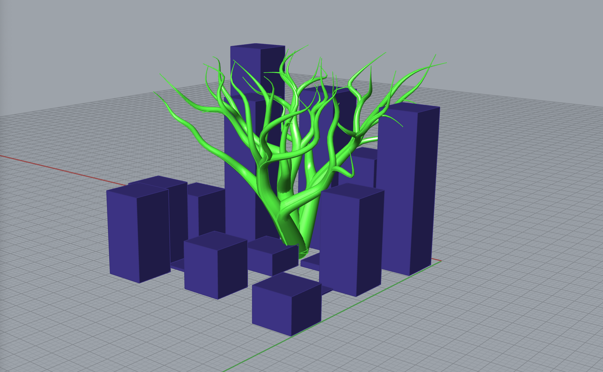

## Growing Forms v2

Let's add some additional intelligence to last week's tree project and explore other Grasshopper Plugins this week, as well as work on our [final brief](../briefs.md) assignments.

-----

### Quick Downloads

Install into the folder revealed by Grasshopper's File->Special Folders->Components.

- [Shortest Walk GH](https://www.food4rhino.com/app/shortest-walk-gh)
- [Cocoon](http://www.bespokegeometry.com/2015/07/22/cocoon/)

Download this so we all can start in the same place...

- [Starting File](3dshortestwalk.gh)

-----

### Review Links

- [Anders Hoff on Growth Algorithms](https://inconvergent.net/generative/)
- [Algorithmic Beauty of Plants](http://algorithmicbotany.org/papers/#abop)
- [Algorithmic Botany (most useful link from above)](http://algorithmicbotany.org/papers/abop/abop-ch1.pdf)

----

### New Goals

The grown, *tree structures* from last week were fun and easy to build. But...

- Though the model's growth was *efficient*, the grown paths were *entirely random*. Trees are contextually aware and are not random in the least.
- The growth rate was *consistent* across the tree. But, trees — under the influence of gravity and wind — branch more often and decrease in cross-sectional area as they grow according to a [formula determined by Leonardo Da Vinci](https://www.wired.com/2011/11/branching-tree-physics/)
- Our model for tree nutrient assumed an even distribution of sunlight. But, as trees grow, solar radiation becomes more energetic!
- The resulting extreme curvature of the forms might model some species of trees, but not others.
- The branches were individual tubes, and were never merged into a single volume. We couldn't 3d print them!

For these reasons, our models more accurately emulated the [growth of corals](https://journals.plos.org/ploscompbiol/article?id=10.1371/journal.pcbi.1002849) and plants in aquatic environents where some of these factors are not present, and not the growth of terrestrial trees. Let's fix these issues!

-----

### Grasshopper Plugin and Specialized Components Research

Try to install these plugins and get them working. Research what the plugin could do for Generative Designers, and try to find some art/architecture/design examples that take advantage of the assigned data, logic, and/or tool. Find whatever assets and tutorials you can!

- AZ : [Architectural Paneling](http://vecg.cs.ucl.ac.uk/Projects/SmartGeometry/paneling/paper_docs/panelization_sigg10_small.pdf) and [Grasshopper's Box Morph Logic](https://formularch.blogspot.com/2012/03/gh-box-morph.html)
- CS : [Geospatial Data](https://en.wikipedia.org/wiki/Geographic_information_system) and [Elk](https://www.food4rhino.com/app/elk)
- DI : [Plane Tiling Tesselations](https://en.wikipedia.org/wiki/Tessellation) and [Starfish](https://www.food4rhino.com/app/starfish)
- JS : [Twist/Morph/Blend/Tween Surfacing](https://books.google.com/books?id=qVsGvohzaJEC&pg=PA29&lpg=PA29&dq=architecture+blend+morph&source=bl&ots=C_M8YPzsYp&sig=jXC9Ji0l0qLI-zt_gZ1Nvf3a_Xw&hl=en&sa=X&ved=2ahUKEwijtY3XvJ_eAhUB0oMKHR1kAvMQ6AEwFXoECAAQAQ#v=onepage&q=architecture%20blend%20morph&f=false) and [Pufferfish](https://www.food4rhino.com/app/pufferfish)
- MI : [Jared Tarbell's Substrate Growth](http://www.complexification.net/gallery/machines/substrate/) and the [Substrate Node in Mesh Triangulation](https://gozourworkshops.wordpress.com/2013/02/17/grasshopper-substrate-tessellation/)
- ML : [Structural Honeycombs and Lattices](https://en.wikipedia.org/wiki/Honeycomb_(geometry)) and [Intralattice](https://www.food4rhino.com/app/intralattice)
- PN : [Fields Lines](https://en.wikipedia.org/wiki/Magnetic_field) in [Grasshopper's Vector Tab](https://formularch.blogspot.com/2014/09/grasshopper-field-lines-3d-dreaming.html) 
- PT : [Programmatic 3D Printing](https://en.wikipedia.org/wiki/G-code) and [Droid](https://www.food4rhino.com/app/droid)

-----

### Brief Examples

- [Unyq](http://unyq.com)
- [Tylko](https://tylko.com)
- [NikeId Custom Shoes](https://www.nike.com/us/en_us/c/nikeid#iUSIGNGldC)
- [Moo](https://www.moo.com/us/)
- [Junddo](https://junddo.com/meuble-vinyle-sur-mesure-portee/)
- [Othr](https://www.othr.com)
- [Shapediver](https://shapediver.com/business-3d-configurators)
- [Smart Blade](https://www.smart-blade.com)
- [Here](https://www.here.com/en/solutions/use-cases/urban-movement?cid=Cities-Google-MM-T1-Here-generic-BMM&utm_source=Google&utm_medium=ppc&utm_campaign=IOT_PaidSearch_PublicSector_AlwaysOn)
- [Conveyal](https://www.conveyal.com/analysis/)
- [Prebuilt](https://www.prebuilt.com.au/our-houses/)
- [Steelcase Space Analytics](https://www.steelcase.com/asia-en/space-analytics/)

-----

### Digital Fabrication Services

- [Shapeways White Label Service](https://business.shapeways.com/blueprint)
- [Ponoko Lasercutting and Assembly](https://www.ponoko.com)
- [Stoll 2D Knitting and 3D Assembly On-Demand](http://stollamerica.com)
- [Fritzing Fab](https://aisler.net/partners/fritzing)
- [3D Systems+Quickparts CNC Machining](https://www.3dsystems.com/on-demand-manufacturing/cnc-machining?keyword=%2Bcnc%20%2Bonline&matchtype=b&awcid=1339267120&agid=53316549545&tid=kwd-300754197733&acc=odm_na&seg=process_cnc&audience=new&glcid=EAIaIQobChMI7e6Wq7-f3gIV0LfACh1KygVgEAAYAyAAEgIg5vD_BwE&gclid=EAIaIQobChMI7e6Wq7-f3gIV0LfACh1KygVgEAAYAyAAEgIg5vD_BwE)