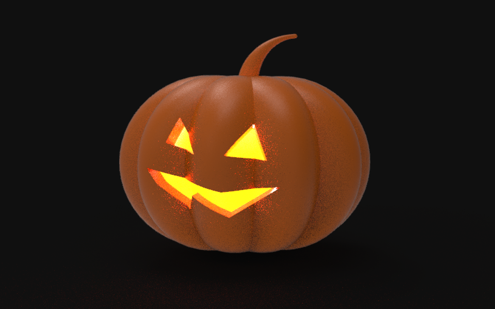
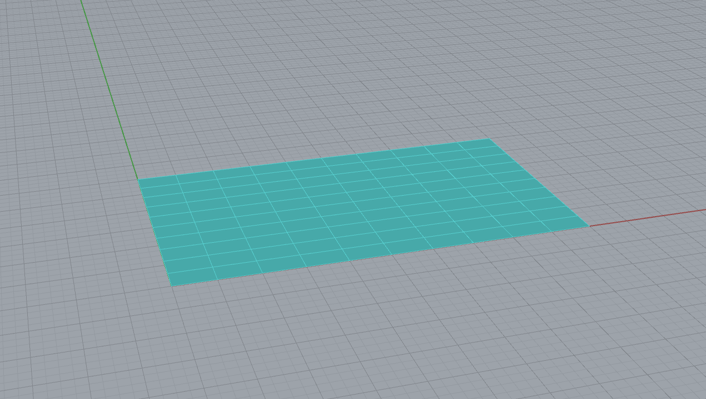
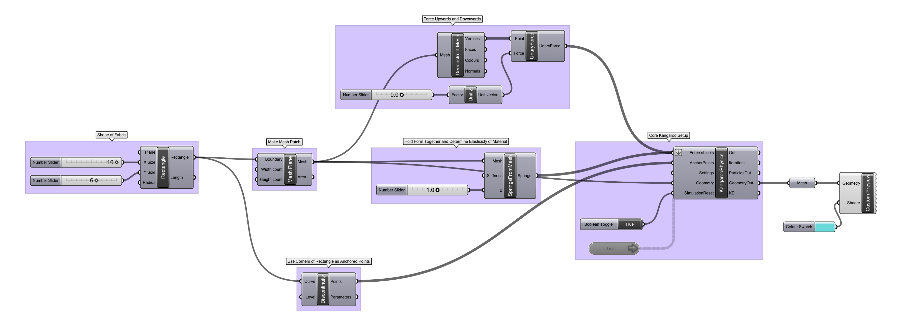
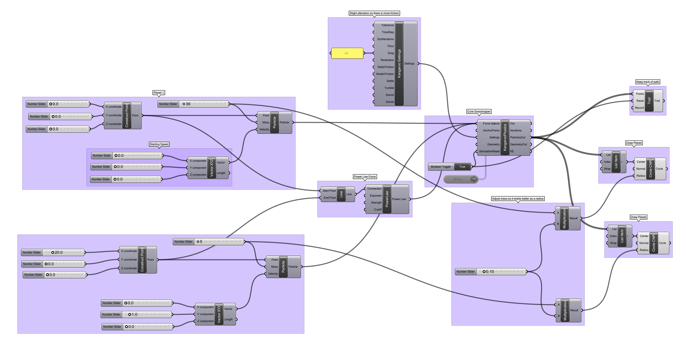
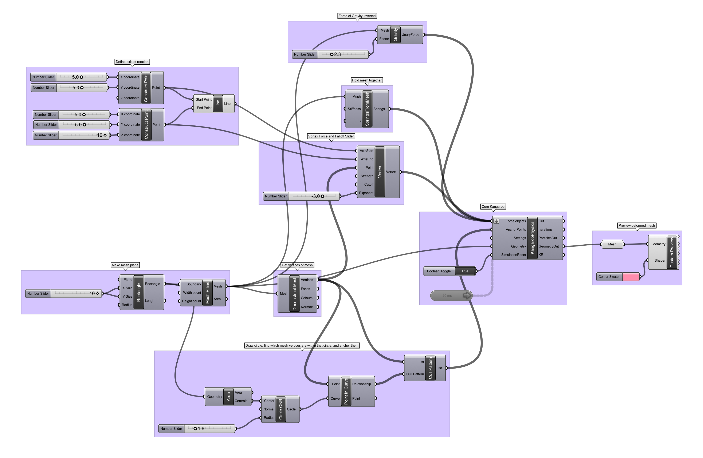
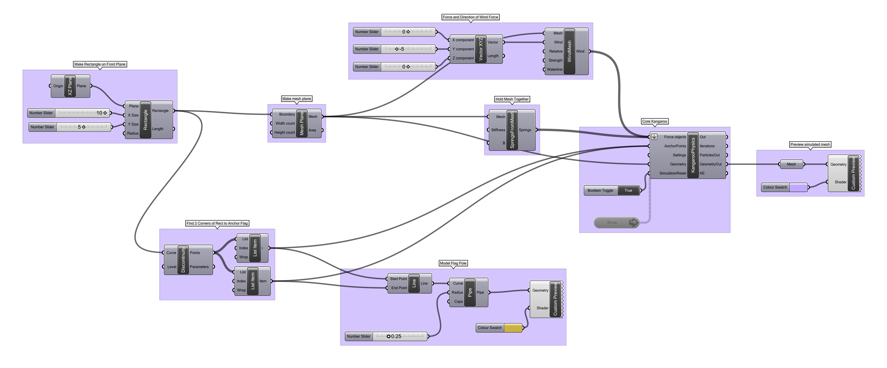

# Spooky Physics!

Time to work today, but something for the holiday too! 

----

### Plugins for the Day

Install both the *Component* and the *User Objects* for Kangaroo.

- [Kangaroo v.099](https://www.food4rhino.com/app/kangaroo-physics)
- [Cytoskeleton, Plankton, and Exoskeleton](https://www.grasshopper3d.com/group/exoskeleton)

-----

### Physics!

Kangaroo is a Physics Simulator that is able to apply forces to both *rigidbody* and *softbody* meshes. Try out all the different forces, they work basically the same way. Lots of designers use Kangaroo to simulate how physical forces would impact their designs as design-engineers. Others use it for pattern generation, user activity simulation, sustainability modeling, form optimization, and all kinds of other purposes! It's very flexible, with a thriving community and lots of [tutorials](https://www.youtube.com/watch?v=zeRe57uoEJQ). 

These are just a few examples...

-----

#### Catenary Forms

Draping, hanging, gravity-driven catenoidal forms like Antoni Gaudi's [*La Sagrada Familia*](http://mathstat.slu.edu/escher/index.php/The_Geometry_of_Antoni_Gaudi#Catenary_Arches_and_Catenoids).

[Download the definition](catenary.gh)

-----

#### Inflated Forms

Inflated, deflated, impressed-pocket, and floating simulation like the work of [Oskar Zieta](https://zieta.pl).

[Download the definition](inflate.gh)

-----

#### Power Law Orbits

See how the planets move, and plan some rocketry like [Os DELTA Oos](https://www.osandoos.com)!

[Download the definition](orbit.gh)

-----

#### Vortex Twists

Simulate tornado twisting and other maelstrom/coriolitic effects like climatologists, or fold up your own digital [Kawasaki Rose](https://www.youtube.com/watch?v=MgXXcY43B7s).

[Download the definition](vortextwist.gh)

-----

#### Wind Modeling

Model wind blasts and other irregular, directional phenomena like waves. Or, take real wind data and embed it in objects like [Miska Knapek](http://knapek.org) or [Adrian Segal](https://www.adriensegal.com).

[Download the definition](wind.gh)

-----

### Homework

Prepare a small presentation on your project proposal for the class. 5-10 slides please.

- Who is your potential audience and how are they the same and different from one another?
- What is your project's overall goal?
- What might your project look like for different users? (sketches!)
- What does your input data look like? Do you have it? If not, how will you collect or simulate it?
- Any parametric progress to show? Any tools that show promise?
- What questions are driving your current progress?
