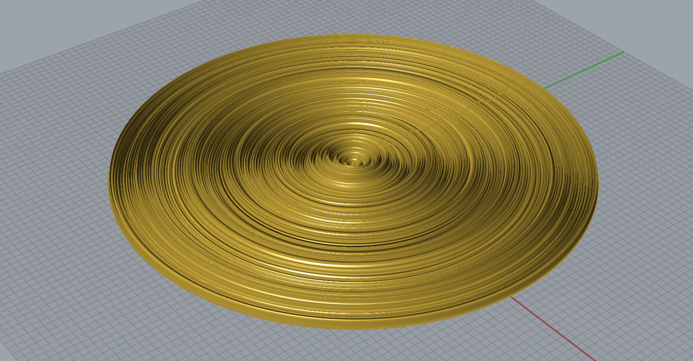

# Headstarts

Some individual places to start for everyone...

----

### Airflow Simulation

Airflow simulation using [Kangaroo]().

[Download Definition](stream.gh)

-----

### Fabric Pattern Construction

Developed pattern for soft-materials construction.

[Download Definition](bra_pattern.gh)

-----

### Audio Sample Surface

Audio data as [sampled amplitudes](https://github.com/zachpino/digidev-s18/blob/master/week09/README.md) realized as a revolved form.

[Download Definition](audio.gh)

-----

### Pressure-Data-Driven Pen

Randomized 'signatures' converted into poetic quill forms.

[Download Definition](pen.gh)

-----

### GeoJSON Map Data

Though Grasshopper can natively handle logitude-latitude couplets, the [Humpback](https://www.food4rhino.com/app/humpback) plugin is required to convert GeoJSON polygons into Grasshopper forms. Follow the installation instructions!

You would likely want to grab geojson files from places [like this](https://data.cityofchicago.org/Community-Economic-Development/Boundaries-Zoning-Districts-current-/7cve-jgbp) and simplify them with [Mapshaper](http://mapshaper.org). Befitting its name, Humpback is *slow*, and so requires more streamlined input data.

[Download Definition](maps.gh)

-----

### Brain Wave Polygonal Lofts via OSC 

Use [Firefly](http://www.fireflyexperiments.com) to make the connection.

[Download Definition](dataloft.gh)

-----

### Styled Prosthetic

Calf forms, created from ellipses, tiled and patterned with various panelling algorithms from [Lunchbox](https://www.food4rhino.com/app/lunchbox) and Pull-to-Surface logics.

[Download Definition](prosthetic.gh)

-----

# Homework

Bring in prototypes. How are you going to build your proposals? Don't forget about the other parts of the [briefs](../briefs.md)!